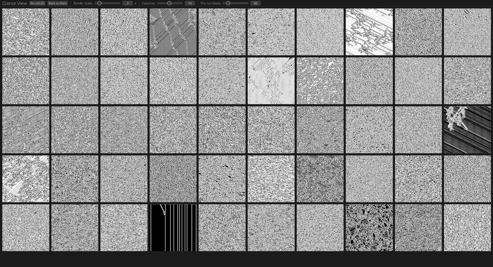

# Cellscape




Cellscape is an art project for finding and exploring visually striking 1D cellular automata.

## How to run

First [install Rust](https://rust-lang.org/tools/install/)

### Native desktop

```
cargo run --release
```

### Web (WebAssembly)

Install the WASM target and trunk:

```
rustup target add wasm32-unknown-unknown
cargo install trunk
```

Development server (live-reloads on changes):
```
trunk serve
```

Production build (output in `dist/`):
```
trunk build --release
```